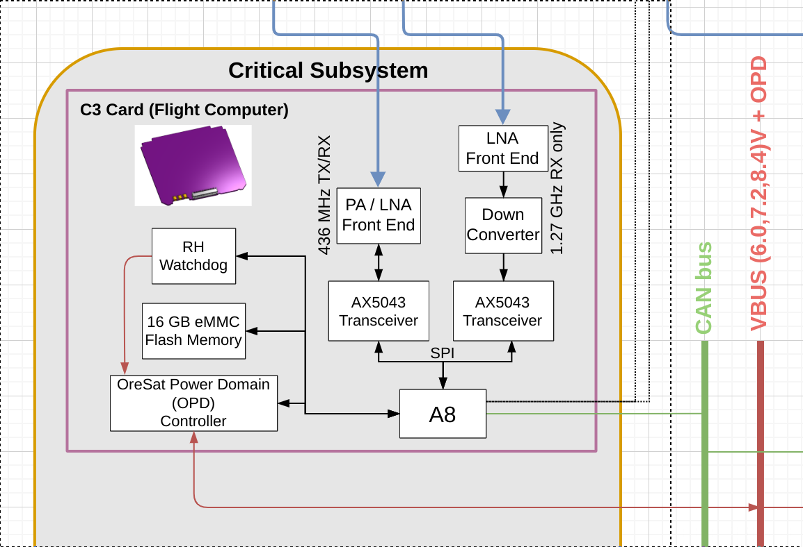
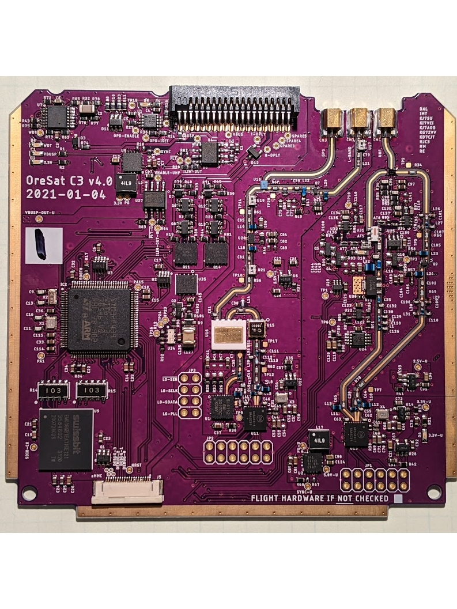

# oresat-c3
## General information
This is the C3 (Command, Communication, and Control) card for OreSat. It
acts as the central control point for the entire OreSat project, provides
telemetry to the ground, and receiver commands. It's the "on board computer"
of the OreSat bus. It has:

- ST STM32F446VET6 Cortex M4F microcontroller
- On Semi AX5043-based L Band (1.2 GHz) receiver
- On Semi AX5043-based UHF Band (436 MHz) receiver and transmitter with 1W PA.
- Custom radiation tolerant watchdog timer based on the TI TLV1042 comparator.
- 16 GB eMMC flash data storage
- 1 Mbit of FRAM for high reliability state and variable storage
- Supercapacitor-backed up RTC
- Two antenna deployment circuits
- OreSat Power Domain (OPD) control circuitry

Further documentation can be found in the [doc](doc) folder.

## Firmware

The firmware for the C3 card is written in C and runs on top of ChibiOS, a small RTOS.
It is integrated into the [oresat-firmware](https://github.com/oresat/oresat-firmware) repository.
The firmware application for this project is located
[here](https://github.com/oresat/oresat-firmware/tree/c3_capstone/src/f4/app_c3_v1).

## Current status: OreSat C3 version 4

C3 V4 is our latest version of the C3 card; it's getting ready for flight in 
Q2 2021 in OreSat0. It's got all of the functionality necessary for flight.

## OreSat C3 V3 (2019-2020 ECE Capstone)

The 2018-2019 ECE Capstone brought the card to version 3. It implements an
STM32F446VET6 IC, the full L band receiver with ultistage LNA, and a UHF radio 
with LNA but no PA for transmitting.

## Breadboard Prototype

Most embedded project starts out as a bunch of development boards strung together;
the C3 is no different! The breadboard prototype for the C3 card implements an
STM32F446RE development board connected to two SPI radios, the OreSat
FlatSat backplane via a CAN transceiver and I2C for the OPD interface,
and a SDIO and SPI connected SD/MMC Card. The breadboard implements
stronger pullups for the I2C lines than the GPIO of the STM32 can
provide. It is currently capable of interfacing with and activating the
OPD connected boards.

## License

All materials in this repo are copyright Portland State Aerospace Society and are licensed under the CERN Open Hardware Licence Version 2 -
Strongly Reciprocal (CERN-OHL-S v2), or any later version. A copy of the license is located in [here](LICENSE.md).

